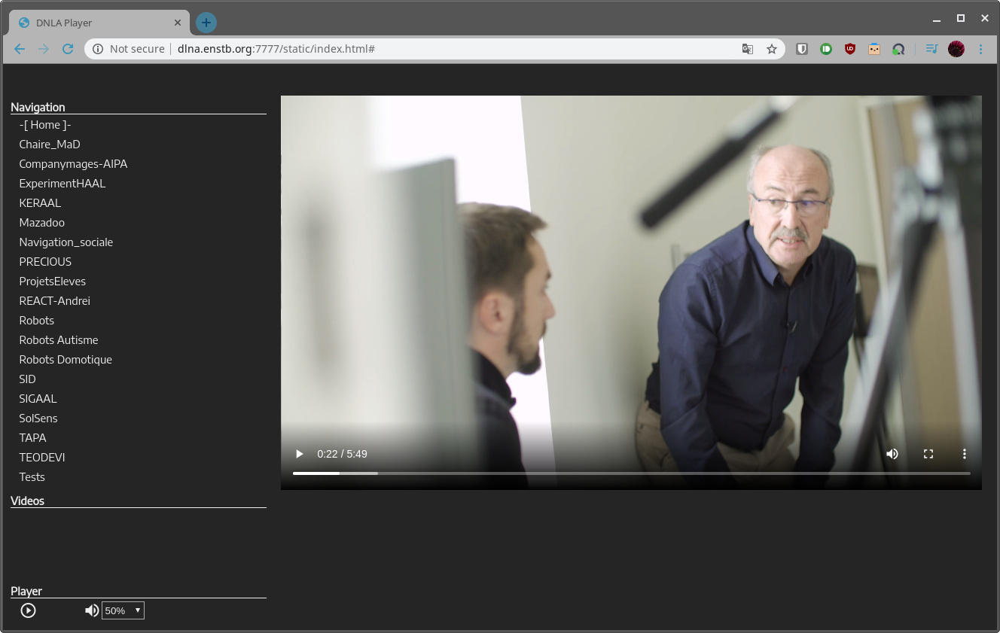

# dlna-web

DLNA-web is an HTML5 video player. It search for DLNA
server on local network, show a list of folders, and
videos. Click on a video to start playing.

We use DLNA-web on a big (75") touch-screen in the lab.
It use Ajax to retreive DLNA ressources. This allows
browsing files while playing.
   

 

    
## Install

    pip install -r requirements.txt (--user if needed)

## Configuration
Edit src/config.py to setup the DLNA path to search
for video.
    
    
## Run

    python src/app.py

Open your browser at http://localhost:7777/
